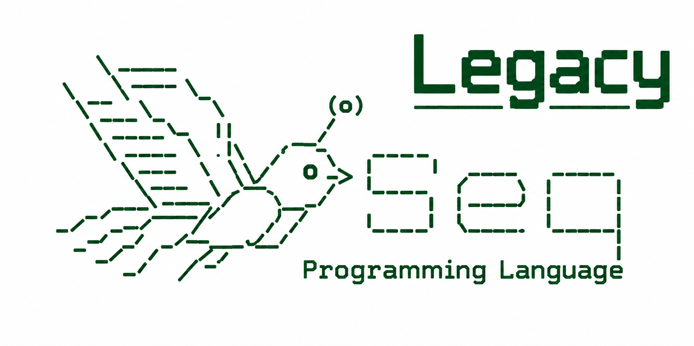

<p align="center">
  
</p>

# seq-lang-legacy

`seqc_legacy` is a proof-of-concept compiler for a small subset of the Seq
language. It turns `main.seq` into a static Linux x86-64 executable using only
its own code: its own code generator, its own assembler and its own linker.
No language model, no GCC, no `as`, no `ld`.

## Build

`seqc_legacy` itself is a C++11 program built with CMake and Ninja; it uses
nothing from a later standard. The run stage executes a Linux binary, so build
and test on Linux or in WSL.

```bash
cmake --preset dev
```

```bash
cmake --build --preset dev
```

```bash
ctest --preset dev
```

The compiler is `build/dev/seqc_legacy`.

## Install
```
bash install-seqc.sh
```

## Use

```bash
seqc_legacy new top3Company
```

```bash
cd top3Company
```

```bash
seqc_legacy src/main.seq
```

`src/main.seq`:

```seq
name = "top3Company"

step step1():
    ask("create file company.txt with 5 sample-company-transaction-db")

step step2():
    ask("for-each transaction get 3 top total-revenue-by-company")
```

Console:

```text
Seq Legacy Compiler

[lex] src/main.seq
[parse] 1 name, 2 steps
[sema] 2 requests
[ir] output/temp/top3Company.ir
[codegen] output/temp/top3Company.asm
[assemble] output/temp/top3Company.lst
[link] output/temp/top3Company.bin
[run] top3Company.bin
Top 3 total-revenue-by-company:
1. Globex 480.00
2. ACME 385.00
3. Initech 292.50
[run] exit 0

Results:
  output/company.txt
```

Project after the build:

```text
top3Company/
├── src/
│   └── main.seq
└── output/
    ├── company.txt             written by the program
    └── temp/
        ├── top3Company.tokens  lexer output
        ├── top3Company.ast     parser output
        ├── top3Company.ir      intermediate representation
        ├── top3Company.asm     generated x86-64 assembly
        ├── top3Company.lst     assembler listing: offsets and bytes
        └── top3Company.bin     the ELF executable
```

Change `5` to `10` and `company.txt` gets ten rows; change `3` to `2` and two
companies are printed.

| Command | Does |
| --- | --- |
| `seqc_legacy new <name>` | Create a project in `./<name>` |
| `seqc_legacy <file.seq>` | Check, build, run, list the results |
| `seqc_legacy --build-only <file.seq>` | Stop after the linker |
| `seqc_legacy check <file.seq>` | Lexer, parser and semantic analysis only |
| `seqc_legacy --help`, `--version` | Usage, version |

Exit codes: 0 success, 1 internal error, 2 usage, 3 source error, 6 the
program failed, 7 filesystem.

## The language

```text
file      := name_decl step+
name_decl := "name" "=" STRING
step      := "step" IDENT "(" ")" ":" NEWLINE
             ( 4 spaces "ask" "(" STRING ")" NEWLINE )+
```

An `ask` must be one of two requests. Only the parts in angle brackets vary.

| Request | Meaning |
| --- | --- |
| `create file <file> with <N> <dataset>` | Write the first N rows of the dataset to `output/<file>` |
| `for-each transaction get <N> top <filter>` | Apply the filter to the rows of the most recent file and print the top N |

Built into the language:

- Dataset `sample-company-transaction-db`: 500 rows of
  `company,quantity,price`, from
  [data/sample-company-transaction-db.txt](data/sample-company-transaction-db.txt).
- Filter `total-revenue-by-company`: the sum of quantity × price per company,
  highest first.

## How it compiles

| Stage | Source | What it does |
| --- | --- | --- |
| Lexer | `src/lexer` | Source text to tokens, one `SourceLine` per line |
| Parser | `src/parser` | Tokens to the syntax tree |
| Semantic analysis | `src/sema` | Checks the tree; matches each `ask` to a request and resolves the dataset and filter |
| IR | `src/ir` | Lowers requests to `write_file` and `print` operations on constant data; the filter is evaluated here |
| Code generator | `src/codegen` | IR to x86-64 assembly text |
| Assembler | `src/assembler` | Assembly text to machine code, symbols and relocations |
| Linker | `src/linker` | Lays out the sections, applies the relocations, writes the ELF file |
| Run | `src/driver` | Executes the binary in `output/` |

The generated program is `_start`, one function per step, and a failure exit.
It calls the kernel directly (`open`, `write`, `close`, `exit`) and links
against nothing. Because the filter is evaluated at compile time, the program
only writes bytes that the compiler already computed.

## Limits of the proof of concept

- Linux x86-64 only. On other systems `seqc_legacy` still builds and
  `--build-only` still writes the ELF file, but it cannot run it.
- The assembler knows nine instructions and the eight low registers
- The executable is one read-and-execute segment with no section headers, so
  `objdump -d` shows nothing; read `output/temp/<name>.lst` instead.

## Project status

This repository is an archive. The code was moved from Subversion to Git and
is kept here for reference; it is no longer developed.

The Seq programming language continues in
[tomjnet/seq-lang](https://github.com/tomjnet/seq-lang), which is the new
repository and where the language evolves.

Website: <https://tomjnet.github.io/seq-lang-legacy/>

## Author

Tom J.
